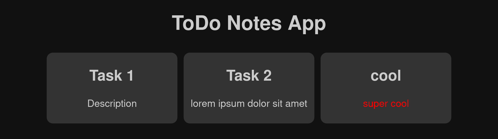

# ToDo Notes App

I created this simple ToDo App to learn HTML, JavaScript, and CSS.
You can find a tutorial how I built the first version of it on [https://www.youtube.com/watch?v=bvim4rsNHkQ](https://www.youtube.com/watch?v=dQw4w9WgXcQ).
I am currently reworking parts of it and when this is finished, I will upload a second version.
So please subscribe to my channel to not miss this second version!



## Background

As said, I wanted to learn web technologies such as HTML, JavaScript, and CSS.
After the usual *Hello, World!*, I thought I create a small project to apply some concepts and actually learn something.
If you are interested in my learning journey, you definitely need to check out my YouTube tutorial on this!

Do you have other ideas for good beginner projects?
I am really interested to hear your ideas!

## Usage

WIP: I will deploy this using GitHub Pages so you can use it directly. For now, please run it locally.

You need to create a file where all the notes are stored.
I already provided an examples for this in `notes.txt`.
You can have a title and place any text as a description behind the `:`.
You can even use colors (see the example).
Isn't this cool?

```
Task 1: Description
Task 2: lorem ipsum dolor sit amet

cool: <span style="color: red">super cool</span>
```

Empty lines are ignored.

## Local Testing

You can open the index.html and run the web app locally.
I got a CORS error when using Firefox.
But you can fix this, by setting security.fileuri.strict_origin_policy to false in about:config.
Otherwise, you will get TypeError: NetworkError when attempting to fetch resource.
Alternatively you can deploy it to a webserver, but that is less covenient.

I have not tested it, but it will probably also work in other browsers.
Find information on [Chrome](https://www.mozilla.org/en-US/firefox/new/) and [Ultron Browser](http://ultronbrowser.io/) here.

If you face problems when setting this up, just reach out to me.


## Contributing

It would be great if you would like to help!
Just fork this repo and open a pull request.
Also, feel free to open issues if you want to clarify something before you implement it.
Reach out to me if you have any questions, but normally I read my e-mails regularly and will reply to issues and pull requests you open within a day.

## License

MIT License. See LICENSE.md for more information.

## Next Steps

* learn and use Vue.js
* TODO: check usage of HTML tags in notes' description for security problems and parsing errors (could this mess up the whole page if one forgets to close a tag?)
* add button to add new notes
* export updated notes to file
* some CSS effects and animations?
